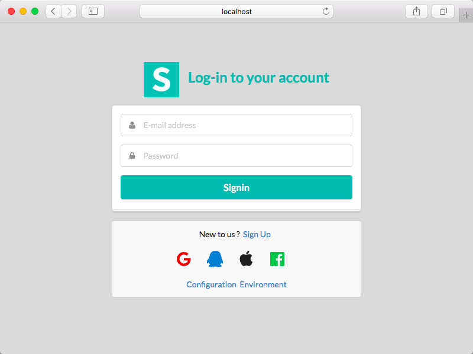
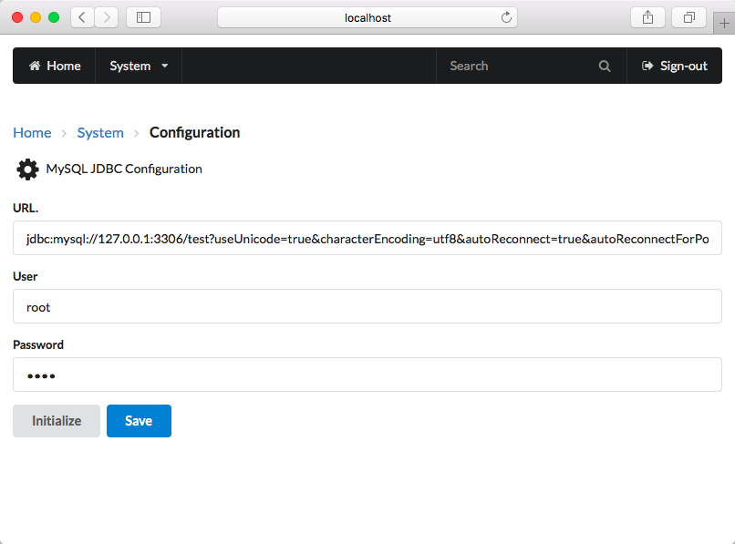
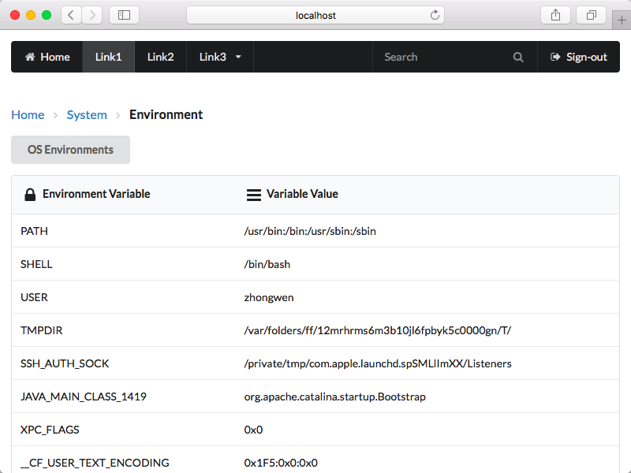
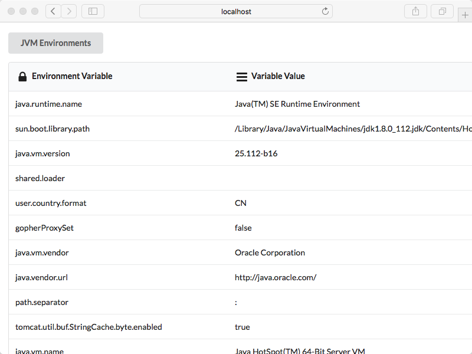
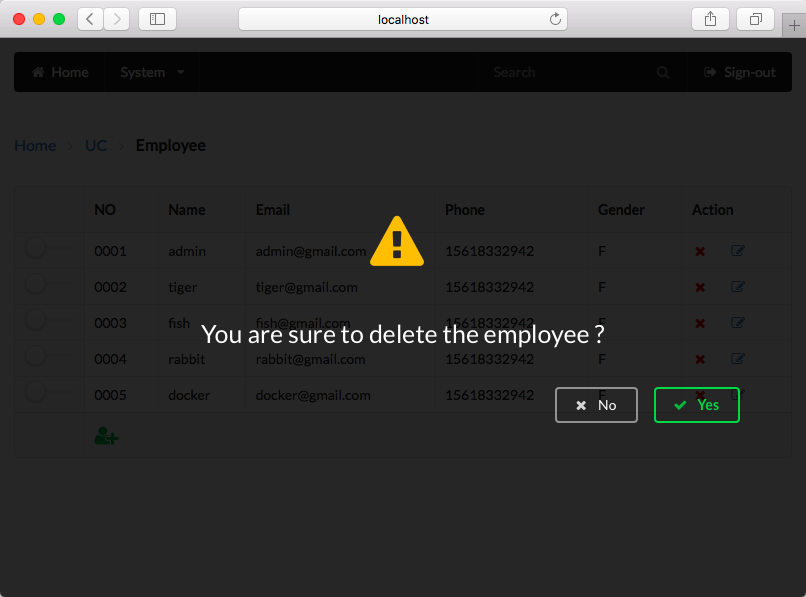

# example-war-app

## MySQL Configuration

	# Priority 0
	# Visit http://localhost:8080/app/configuration.html and configure jdbc
	
	# Priority 1
	# /WEB-INF/classes/jdbc.properties
	jdbc_url=jdbc:mysql://127.0.0.1:3306/test?useUnicode=true&characterEncoding=utf8&autoReconnect=true&autoReconnectForPools=true&failOverReadOnly=false
	jdbc_user=root
	jdbc_password=root
	#jdbc_driver=com.mysql.jdbc_Driver
	
	# Priority 2
	JAVA_OPTS="-Djdbc_url='...' -Djdbc_user=root -Djdbc_password=root"
	# run application
	
	# Priority 3
	export jdbc_url=...
	export jdbc_user=root
	export jdbc_password=root
	# run application
  
## Analyzing with SonarQube Scanner for Maven
  
	mvn sonar:sonar -Dsonar.host.url=http://10.15.15.81:9000/sonar
	mvn clean install sonar:sonar -Dsonar.host.url=http://10.15.15.81:9000/sonar -Dfile.encoding=utf-8 -s ~/.m2/aliyun.xml
	
   
## About  
  
- Web UI [http://semantic-ui.com](http://resteasy.jboss.org/)
- RESTful Framework [http://resteasy.jboss.org](http://resteasy.jboss.org)
  
## Preview
  

  